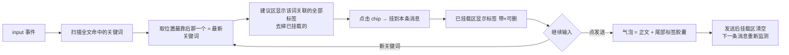

# AI 整理「关键词 → 标签备注」机制（方案文档 v2，2026-09-11 讨论）

> 状态：**已对齐交互模型与词表 v2，未开发**。开发前按本文档落地，忘了以本文档为准。
> 背景：AI 对话页「不好用」的根因不在模型，而在输入侧没有引导——用户不知道怎么说才准，
> 模糊描述（"弄干净点"）导致来回试。水印/去前缀这类 AI 已识别很准，**不做标签**；
> 标签只收「模型容易跑偏的输出格式纪律」类指令。

## 1. 交互模型（已与用户对齐）

**关键词触发 → 显示按钮 → 点击挂载 → 备注跟随气泡**。



例子：输入「这些电影应该是这样…」→ 捕捉「电影」→ 上方弹【电影格式】等 chip；
点它 → 标签挂上；接续输入「…番号要统一」→ 建议区换成番号相关，再点【番号大写】；
发送 → 气泡正文 + 尾部【电影格式】【番号大写】两个小胶囊；AI 收到：

```
这些电影应该是这样的，番号也要统一
【备注：电影命名采用：标题.原始标题（如有）.年份；番号字母部分统一大写】
```

### 关键决策（已拍板）

| 决策点 | 结论 |
|---|---|
| 标签生命周期 | **消息级**：发送即随气泡走掉，不跨气泡残留 |
| 关键词与标签关系 | **交叉（一对多）**：一个关键词带出多个标签（如「格式」→ 电影格式+剧集格式） |
| 检测范围 | **只检测最新关键词**：全文扫描后取位置最靠后命中的那一词，避免建议区堆砌 |
| 已挂载后关键词消失 | **不自动撤**，只有手动 × 或发送才清 |
| 重复挂载 | 同一标签挂载后，建议区不再显示它 |
| 气泡标签 | 只读展示（浅灰小胶囊 + 小字），可点 × 删除发生在**发送前**的挂载区 |
| 自动消息 | 「继续出下一批」等 `opts.auto` 代发消息**不带**标签 |
| 触发词禁选 | 不用「整理/清理」这类必现词做触发词（页面名就叫 AI 整理，会一直弹） |

## 2. 标签库 v2（16 条 = 影片 5 + 通用 11）

标签名口语化，看名字就懂。两组结构：

### 影片专用（5）

| id | 标签 | 发给 AI 的备注文本 |
|---|---|---|
| movieFmt | 电影格式 | 电影命名采用：`标题.原始标题（如有）.年份` |
| tvFmt | 剧集格式 | 剧集命名：`剧名.SxxExx.集标题（如有）`，一季一个文件夹 |
| fanUpper | 番号大写 | 番号字母部分统一大写（`abc-123 → ABC-123`） |
| addYear | 补年份 | 文件名缺年份时在标题后补 `.年份` |
| keepTitle | 带原始标题 | 文件名保留原始外语标题（如有），放在中文标题后面 |

### 通用整理（11，不分内容类型）

| id | 标签 | 发给 AI 的备注文本 |
|---|---|---|
| extLower | 后缀小写 | 文件扩展名统一改为小写 |
| spaceNorm | 下划线转空格 | 文件名里的下划线和连续点改成单个空格 |
| illegalChar | 去特殊符号 | 删掉/替换系统不允许的字符（`\ / : * ? " < > \|`） |
| fullWidth | 全角转半角 | 全角括号、冒号等符号转成半角 |
| seqPad | 序号补零 | 序号统一位数（`1 → 001`，按总数定宽度） |
| dupMark | 去复本标记 | 删掉文件名末尾的 `(1)` `(2)` 这类重复下载标记 |
| shorten | 超长名缩短 | 文件名过长时缩短，保留关键信息 |
| trimSpace | 多余空格清理 | 连续空格合一、去首尾空格 |
| subFollow | 字幕跟随 | 改名时同目录同名的 nfo/srt/ass 一起跟着改 |
| stayPut | 只改名不移动 | 保持原目录层级，只改名 |
| archive | 分类归档 | 按类型（视频/文档/图片/其他）分文件夹归档，缺的文件夹新建 |

## 3. 关键词路由表（交叉关系落库处）

```js
var TIDY_KEYWORDS = [
  { kw: /格式|命名规范/i,              tags: ['movieFmt','tvFmt'] },
  { kw: /电影|影片|movie/i,            tags: ['movieFmt'] },
  { kw: /剧集|连续剧|第.{0,3}季|S\d{2}E/i, tags: ['tvFmt'] },
  { kw: /番号|车牌/i,                 tags: ['fanUpper'] },
  { kw: /年份|(19|20)\d{2}/i,         tags: ['addYear'] },
  { kw: /外语|原始标题|英文名/i,        tags: ['keepTitle'] },
  { kw: /后缀|扩展名|大小写/i,          tags: ['extLower','fanUpper'] },
  { kw: /下划线|空格|间隔|点/i,         tags: ['spaceNorm','trimSpace'] },
  { kw: /符号|特殊字符|非法|冒号|问号/i,  tags: ['illegalChar','fullWidth'] },
  { kw: /全角|括号/i,                 tags: ['fullWidth'] },
  { kw: /序号|编号|补零|位数/i,         tags: ['seqPad'] },
  { kw: /照片|图片|\(\d\)/i,          tags: ['dupMark','seqPad'] },
  { kw: /太长|超长|名字长/i,            tags: ['shorten'] },
  { kw: /字幕|nfo|srt/i,              tags: ['subFollow'] },
  { kw: /移动|归档|分类|文件夹/i,        tags: ['archive','stayPut'] },
  { kw: /只改名|不挪|原目录/i,          tags: ['stayPut'] }
];
```

加词条只改这一个数组；标签与备注在 `TIDY_TAGS` 独立维护。

## 4. 实现清单（开发时照此改）

| 文件 | 位置 | 改动 |
|---|---|---|
| `src/ui-ios.js` | 新增 | `TIDY_TAGS` + `TIDY_KEYWORDS` + `matchTags(text)` 纯函数 + `tidyHintTap(id)` / `tidyHintRemove(id)` + `tidyState.mountedHints` |
| `src/ui-ios.js` | 8869 `tidyChatSend` | 发送前把挂载标签拼成 `【备注：…；…】` 附在正文后；发送后清空挂载区 |
| `src/ui-ios.js` | 8488 `renderTidyChat` | `me` 气泡尾部渲染只读小胶囊（消息记录加 `m.hints = ['电影格式',…]`） |
| `src/ui-ios.js` | 初始化处 | textarea 绑 `addEventListener('input', …)`（当前 `tidyChatInput` 全文仅 8870 取值，无任何 input 监听） |
| `nfo-editor-ios.html` | 1168-1171 | `.tidy-chat-acts` 区改成两行：已挂载区 + 建议区（都是胶囊 chips，横滑） |
| `styles/ios.css` | 1685 附近 | 建议态 = 浅灰胶囊；挂载态 = 主题色胶囊 + ×；气泡内标签 = 极浅灰小字胶囊 |
| `tests/` | 新增 | `matchTags` 断言：关键词命中、最新词优先、交叉带多标签、去已挂载 |

校验流程照旧：`node tools/check.js` → `node tools/bump.js <尾号> "…"`。

## 5. 开放问题（开发前确认）

1. 气泡里标签的视觉形态最终确认（浅灰小胶囊 vs 紫色小字）——实现后真机截图定。
2. 词表正则是否要覆盖英文输入（movie/format 等）——v2 先中文为主，少量英文。
3. 标签备注与规则页 `RULE_INFO` 的命名规范是否要互相引用（同一处维护）——暂两处独立，改版时对齐。
